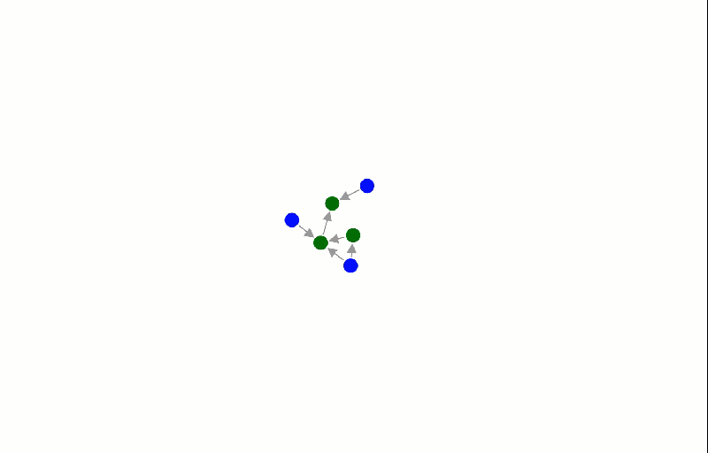

# Python Wrapper for [d3js](https://d3js.org/)

## Why

**D3JS** is awesome, but such a pain to use from Python! This package aims to simplify that.

## Install

```
pip install py3js
```

## Force Directed Graphs

Simplest example - draw a simplified software release stages and teams involved:

```python
	from py3js.network import ForceDirectedGraph, Node, Link

    g = ForceDirectedGraph(1000, 500)

    nodes = ["dev", "pre-prod", "prod", "developers", "testers", "managers"]
    colours = ["green", "green", "green", "blue", "blue", "blue"]

    for n, c in zip(nodes, colours):
        g.add_node(Node(n, color=c))

    # link process
    g.add_link(Link("dev", "pre-prod"))
    g.add_link(Link("pre-prod", "prod"))

    # link involved
    g.add_link(Link("developers", "dev"))
    g.add_link(Link("developers", "pre-prod"))
    g.add_link(Link("testers", "pre-prod"))
    g.add_link(Link("managers", "prod"))

    g.save("c:\\tmp\\1.html")
```

Produces:



Nodes are draggable, have arrows, and tooltips.

